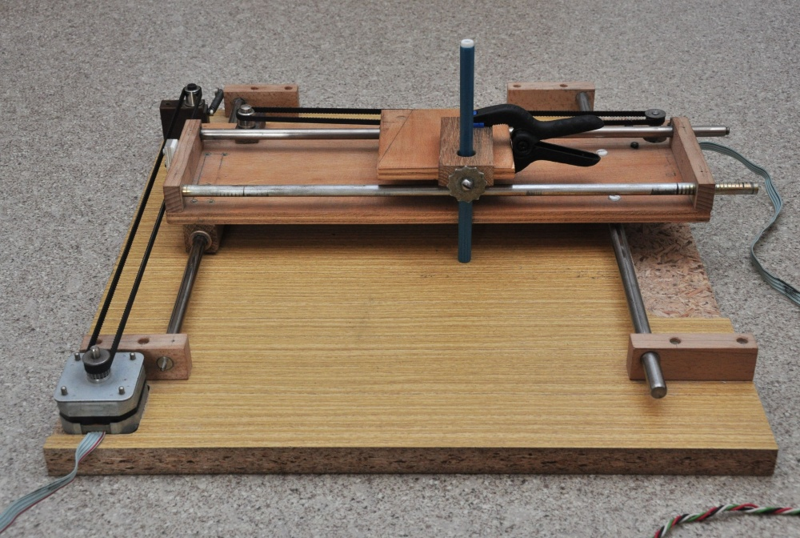
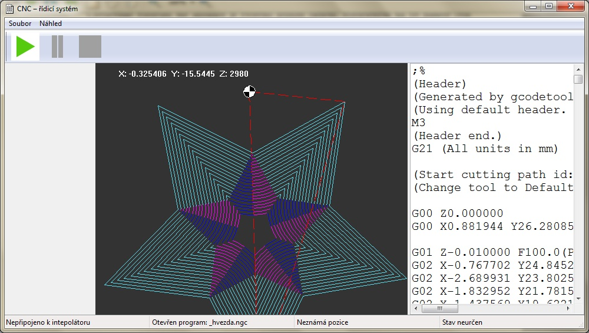

Český popis k nalezení níže.

# Design of a Control System for a CNC Machine with a Focus on the Movement Dynamics

This is a backup of my high school project created back in 2013. It is a direct
copy, without any modification. Because I was stupid when I was a kid, the
source is quite messy.

I design a control system for a 3-axis hobby CNC machine from scratch. I focus
on the dynamics of the movement and I try to not only limit acceleration, but
also a jerk (derivation of acceleration) and also keep it continuous. To achieve
that I use S-curves.

The user interface is realized via a personal computer with a special hardware
unit for interpolation of the movement. This unit is build on the STM32F4
Discovery kit. It communicates via USB with the computer.

The system takes G-code as an input. It can interpret all commonly used
functions - even cutter compensation.

The whole thesis in Czech, but even though you might want to check out the [final
version](text/final.pdf) - there are lots of images and a nice formulas! The
thesis won a 2nd place in [SOČ](http://soc.cz).

# Návrh řídícího systému CNC stroje se zaměřením na dynamiku pohybu

Tento repozitář je záložní kopií mého středoškolského projektu z roku 2013.
Projekt nebyl nijak modifikován a je v původní (lehce chaotické) verzi.

V této práci navrhuji řídicí systém pro tříosý hobby CNC stroj. Zaměřuji se na
dynamiku pohybu a snažím se nalimitovat pouze hodnotu zrychlení (což je běžné),
ale i hodnotu tzv. ryvu (jerku). Kromě limitování jeho hodnoty se znažím
zachovat i jeho spojitý průběh. K docílení toho jsou použity akcelerační
S-křivky.

Celý systém je realizován na klasickém PC se speciálním hardwarovou jednotkou,
která generuje řídicí signály a realtimové záležitosti. Tato jednotka je
založena na STM32F4 Discovery kitu a s počítačem komunikuje pomocí USB.

Systém bere na vstupu G-kód a zvládá interpretovat všechny běžné používané
příkazy - včetně kompenzace nástroje.

Práce vyhrála 2. místo na [SOČ](http://soc.cz). Finální verze textu je k
nalezení [zde](text_v2/final.pdf).